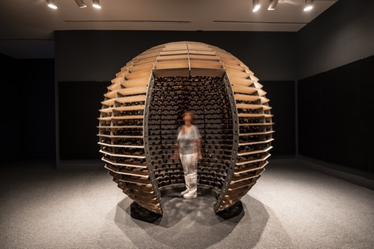

# Fiche d'oeuvre : Résonance
- [ ] Lieu : College Montmorency 
- [ ] Date de la visite: 25/03/2025 
- [ ] Nom de l'exposition: Conférence avec Jade Séguela 
- [ ] Type d'exposition: exposition temporaire 
- [ ] Année de realisation: 2025 

## Introduction
Le 25 mars, on a eu la chance d'acceuillir Jade Séguela, qui est la ---- , nous a présenter son quotidient avec l'artiste LOZANO-HEMMER. Elle nous a expliquer en quoi consistait son travail, son quotidien au coté de l'artiste et nous a parler d'un des plus récents projets, Shadow Tuner, ainsi qu'un projet un peu plus ancien mais qui a marquer la carriere de Mr. Hemmer, Sphere Packing: Bach.

## Son role
Jade Séguela est ---. Par son explication, elle s'occupe de faire les emballages pour différentes expositions autour de monde ainsi que l'inventaire avant et apres ces expositions. Elle prépare donc tout le matériel a l'avance pour réussir a proposer une exposition de qualité a tout les visiteurs ainsi qu'a la personne qui a fait la demande des services de Monsieur Lozano-Hemmer. Son role étant crucial dans cette optique, l'espace pour l'erreur est casi inexistant, car la moindre erreur peut empecher le bon déroulement des chose. 
Meme si elle fait un travail assez stressant et demandant physique et mentalement, elle nous dit adorer son poste et ne pas vouloir l'échanger. Son experience au coté de Lozano est decrit comme étant instructif et inspirant. 

## Sphere Packing: Bach

  

Source: Site officiel de Lozano-Hemmer - https://www.lozano-hemmer.com/sphere_packing_bach.php  

Mon projet préférer parmis les 2 dont elle nous a parler est Sphere Packing: Bach.  
L'idée en elle meme m'a beaucoup attirer. Pouvoir montrer la difference entre les différents artistes et leur activité en quelques dispositif est un facon ingénieuse de demontrer les heures de travail necessaire afin d'atteindre le niveau d'un artiste de renom comme Bach. 
l'installation en elle meme est tres complexe: Une sphere en bois est construite, puis 1128 haut-parleures sont installer dans les crevaces, relier a un ordinateur par une tonne de cables pour permettre au son de demarrer. Le tout est ensuite placer dans une grande salle, mise en route et les 1128 haut-parleurs se mettent en marche en meme temp, demarrant un cacophonie avec la musique faite par Bach durant sa vie. Le tout est ensuite mis en marche par plus de 11km de cables éléctriques.  

## Conclusion

Bien que l'oeuvre en elle meme est tres bruyante et qu'en fin de compte, on n'entend qu'une cacophonie de son dont on ne peut rien discerner, 

## Réferences
> 📍Colege montmorency, QC, Canada
> Site officiel de Lozano-Hemmer : https://www.lozano-hemmer.com/sphere_packing_bach.php
